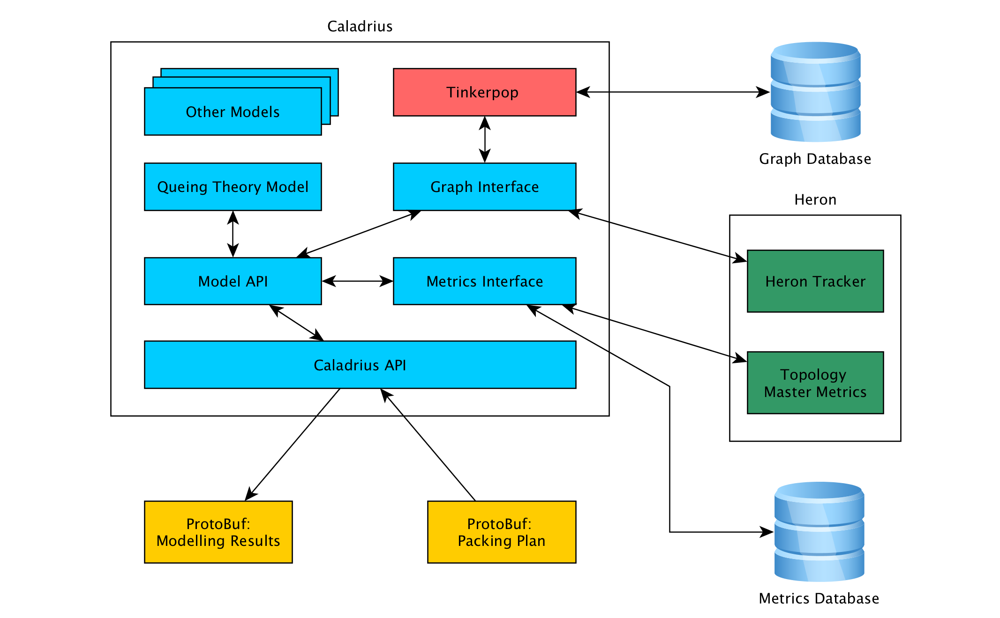

# Caladrius - Design Document

[//]: # (This is the format for leaving a comment that will not be rendered in
         the output file. A bit clunck but Markdown has no official comment 
         syntax)

## Introduction

This is the design document for the Heron topology modelling service
*Caladrius*^[This is the Roman name for the legend of the healing bird that
takes sickness into itself, the ancient Greek version of this is called
*Dhalion*]. The aim of this service is to accept a packing plan for a Heron
topology and use metrics from that running topology to predict its performance
if it were to be configured according to the proposed packing plan.

## System Overview

The proposed layout for the system is shown below:

### System Operation

In order to model a proposed packing plan, the protocol buffer `packing_plan`
message is issued to the Caladrius API. The API then passes the plan, along
with instances of the Metrics and Graph interfaces to one or more Model
implementations^[In future which model to use could be included in the request.
For now it will just be configured on the Caladrius side].

The Model instances then use their custom code along with data provided by the
Metrics and Graph interfaces to calculate the expected performance. The results
of this modelling are then reported via a protocol buffer `modelling_results`
message^[Alternatively this could be a simple JSON message].

## Model Interface

## Metrics Interface

## Graph Interface

## Language

All the main components of Caladrius will be written in Python^[Python here
refers to Python 3 not Python 2 or Legacy Python as it is now known]. The
Metric, Graph and Model interfaces will be provided via abstract base classes
so that other implementations can be provided. 

The main Caladrius API will be a Protocol Buffer Service and so in theory could
be implemented in any language. The use of Tinkerpop for the graph interface
also means that the graph databased service can be accessed in any Tinckerpop
supported language.
